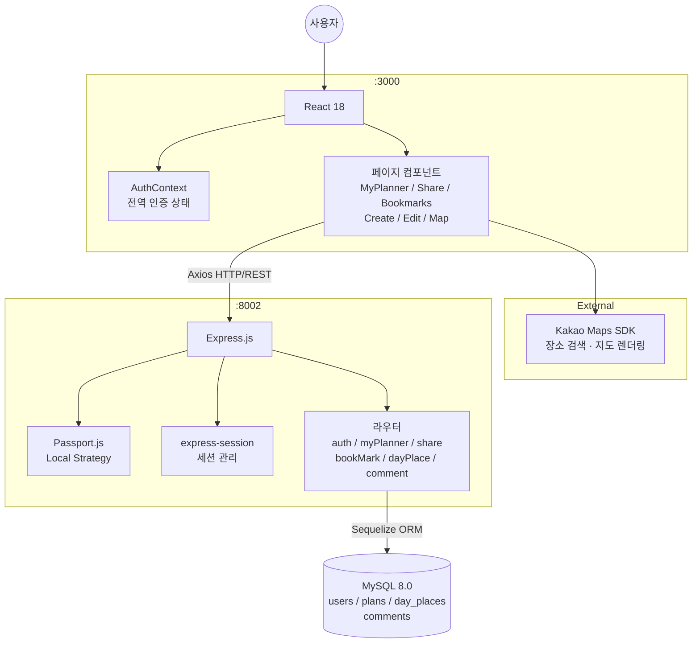
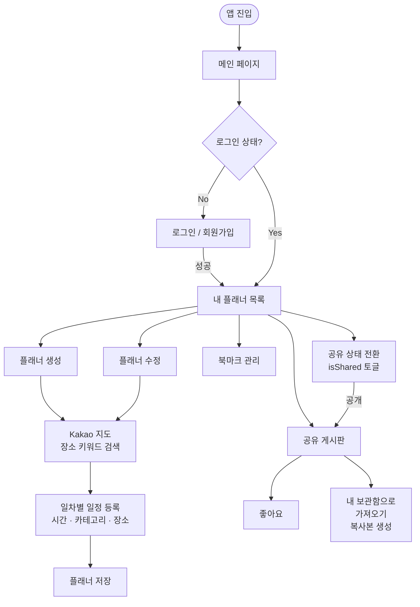
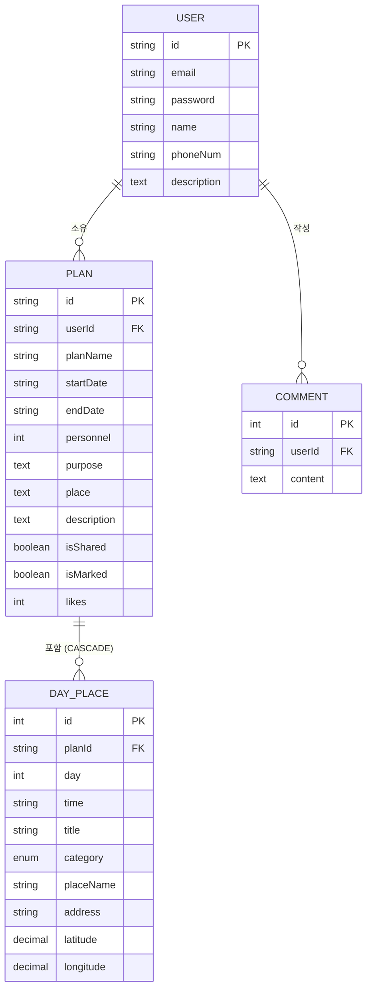
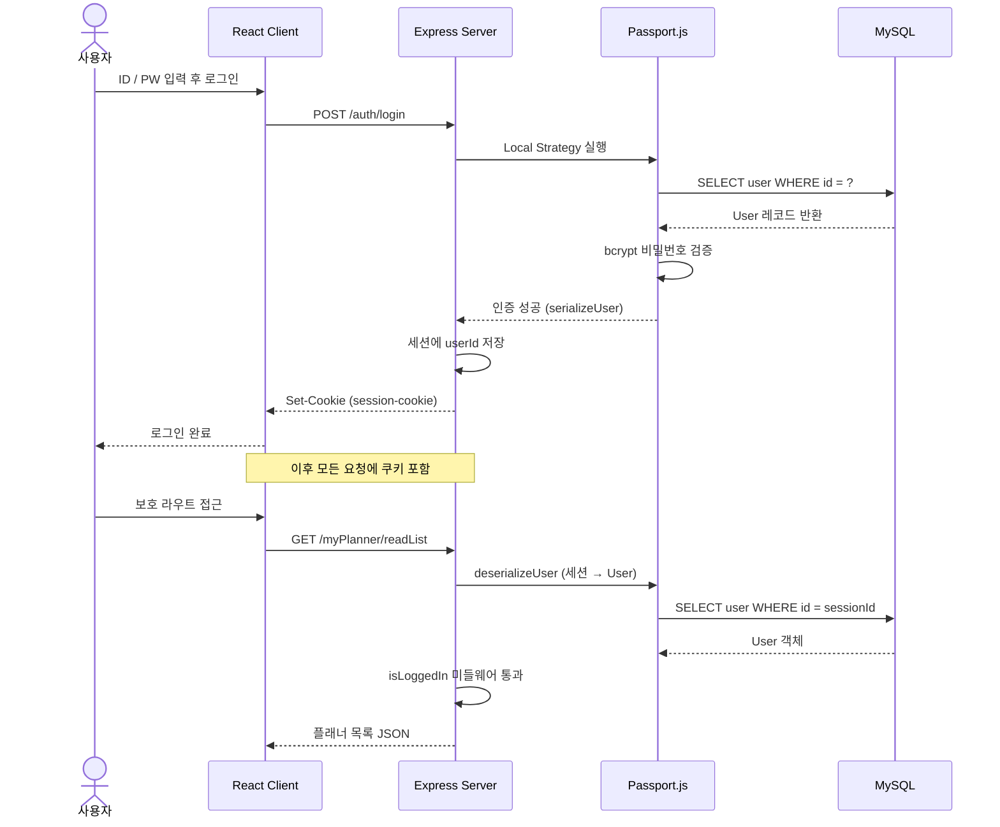
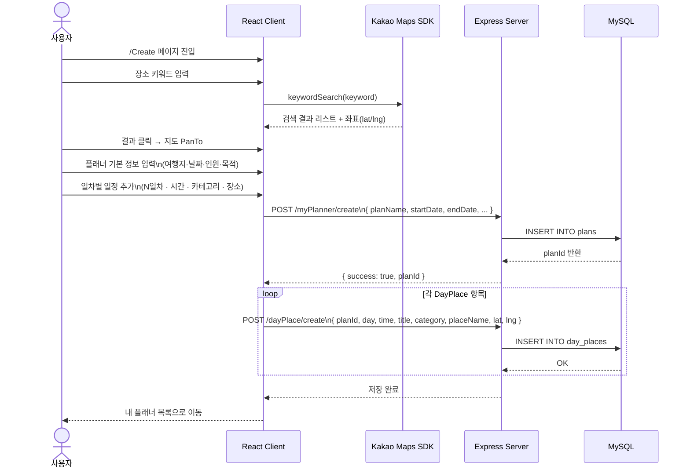

# 0UTripPlanner — 서비스 흐름 & 아키텍처

## 1. 시스템 아키텍처

```mermaid
graph TD
    User((사용자)) --> React

    subgraph Frontend [:3000]
        React[React 18]
        AuthCtx[AuthContext\n전역 인증 상태]
        Pages[페이지 컴포넌트\nMyPlanner / Share / Bookmarks\nCreate / Edit / Map]
        React --> AuthCtx
        React --> Pages
    end

    subgraph External
        KakaoSDK[Kakao Maps SDK\n장소 검색 · 지도 렌더링]
    end

    Pages --> |Axios HTTP/REST| Express
    Pages --> KakaoSDK

    subgraph Backend [:8002]
        Express[Express.js]
        Passport[Passport.js\nLocal Strategy]
        Session[express-session\n세션 관리]
        Routes[라우터\nauth / myPlanner / share\nbookMark / dayPlace / comment]
        Express --> Passport
        Express --> Session
        Express --> Routes
    end

    Routes --> |Sequelize ORM| MySQL[(MySQL 8.0\nusers / plans / day_places\ncomments)]
```

---

## 2. 사용자 서비스 흐름

```mermaid
flowchart TD
    Start([앱 진입]) --> Main[메인 페이지]

    Main --> AuthCheck{로그인 상태?}

    AuthCheck --> |No| AuthPage[로그인 / 회원가입]
    AuthPage --> |성공| MyPlanner

    AuthCheck --> |Yes| MyPlanner[내 플래너 목록]

    MyPlanner --> Create[플래너 생성]
    MyPlanner --> Edit[플래너 수정]
    MyPlanner --> Bookmark[북마크 관리]
    MyPlanner --> ShareBoard[공유 게시판]

    Create --> MapSearch[Kakao 지도\n장소 키워드 검색]
    Edit --> MapSearch
    MapSearch --> DayPlace[일차별 일정 등록\n시간 · 카테고리 · 장소]

    DayPlace --> SavePlan[플래너 저장]

    ShareBoard --> Like[좋아요]
    ShareBoard --> Import[내 보관함으로\n가져오기\n복사본 생성]

    MyPlanner --> ShareToggle[공유 상태 전환\nisShared 토글]
    ShareToggle --> |공개| ShareBoard
```

---

## 3. 데이터 모델 관계도 (ERD)

```mermaid
erDiagram
    USER {
        string id PK
        string email
        string password
        string name
        string phoneNum
        text   description
    }

    PLAN {
        string  id        PK
        string  userId    FK
        string  planName
        string  startDate
        string  endDate
        int     personnel
        text    purpose
        text    place
        text    description
        boolean isShared
        boolean isMarked
        int     likes
    }

    DAY_PLACE {
        int     id       PK
        string  planId   FK
        int     day
        string  time
        string  title
        enum    category
        string  placeName
        string  address
        decimal latitude
        decimal longitude
    }

    COMMENT {
        int    id     PK
        string userId FK
        text   content
    }

    USER ||--o{ PLAN     : "소유"
    USER ||--o{ COMMENT  : "작성"
    PLAN ||--o{ DAY_PLACE : "포함 (CASCADE)"
```

---

## 4. 인증 흐름 (Passport.js Session)

```mermaid
sequenceDiagram
    actor 사용자
    participant React   as React Client
    participant Express as Express Server
    participant Passport as Passport.js
    participant DB      as MySQL

    사용자->>React: ID / PW 입력 후 로그인
    React->>Express: POST /auth/login
    Express->>Passport: Local Strategy 실행
    Passport->>DB: SELECT user WHERE id = ?
    DB-->>Passport: User 레코드 반환
    Passport->>Passport: bcrypt 비밀번호 검증
    Passport-->>Express: 인증 성공 (serializeUser)
    Express->>Express: 세션에 userId 저장
    Express-->>React: Set-Cookie (session-cookie)
    React-->>사용자: 로그인 완료

    Note over React,Express: 이후 모든 요청에 쿠키 포함

    사용자->>React: 보호 라우트 접근
    React->>Express: GET /myPlanner/readList
    Express->>Passport: deserializeUser (세션 → User)
    Passport->>DB: SELECT user WHERE id = sessionId
    DB-->>Passport: User 객체
    Express->>Express: isLoggedIn 미들웨어 통과
    Express-->>React: 플래너 목록 JSON
```

---

## 5. 플래너 생성 & 일정 등록 흐름

```mermaid
sequenceDiagram
    actor 사용자
    participant React    as React Client
    participant KakaoAPI as Kakao Maps SDK
    participant Express  as Express Server
    participant DB       as MySQL

    사용자->>React: /Create 페이지 진입
    사용자->>React: 장소 키워드 입력
    React->>KakaoAPI: keywordSearch(keyword)
    KakaoAPI-->>React: 검색 결과 리스트 + 좌표(lat/lng)
    사용자->>React: 결과 클릭 → 지도 PanTo

    사용자->>React: 플래너 기본 정보 입력\n(여행지·날짜·인원·목적)
    사용자->>React: 일차별 일정 추가\n(N일차 · 시간 · 카테고리 · 장소)

    React->>Express: POST /myPlanner/create\n{ planName, startDate, endDate, ... }
    Express->>DB: INSERT INTO plans
    DB-->>Express: planId 반환
    Express-->>React: { success: true, planId }

    loop 각 DayPlace 항목
        React->>Express: POST /dayPlace/create\n{ planId, day, time, title, category, placeName, lat, lng }
        Express->>DB: INSERT INTO day_places
        DB-->>Express: OK
    end

    Express-->>React: 저장 완료
    React-->>사용자: 내 플래너 목록으로 이동
```
