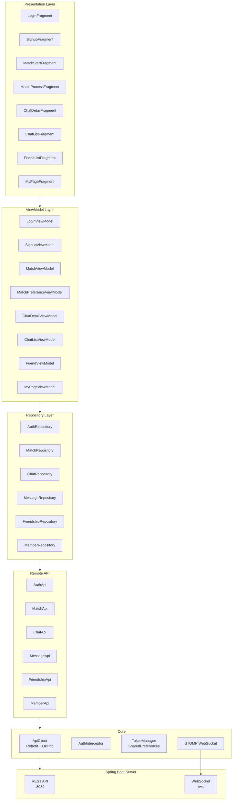
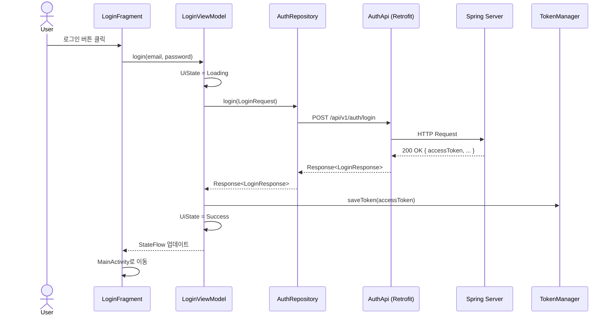
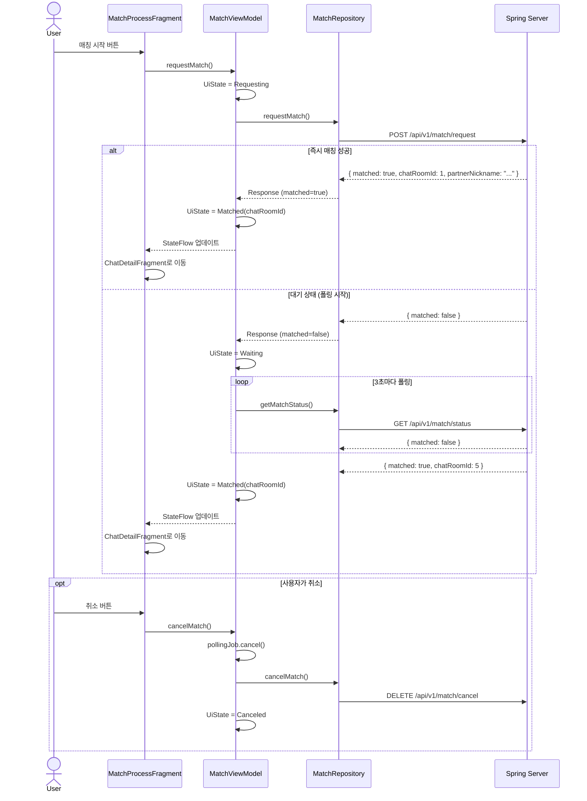
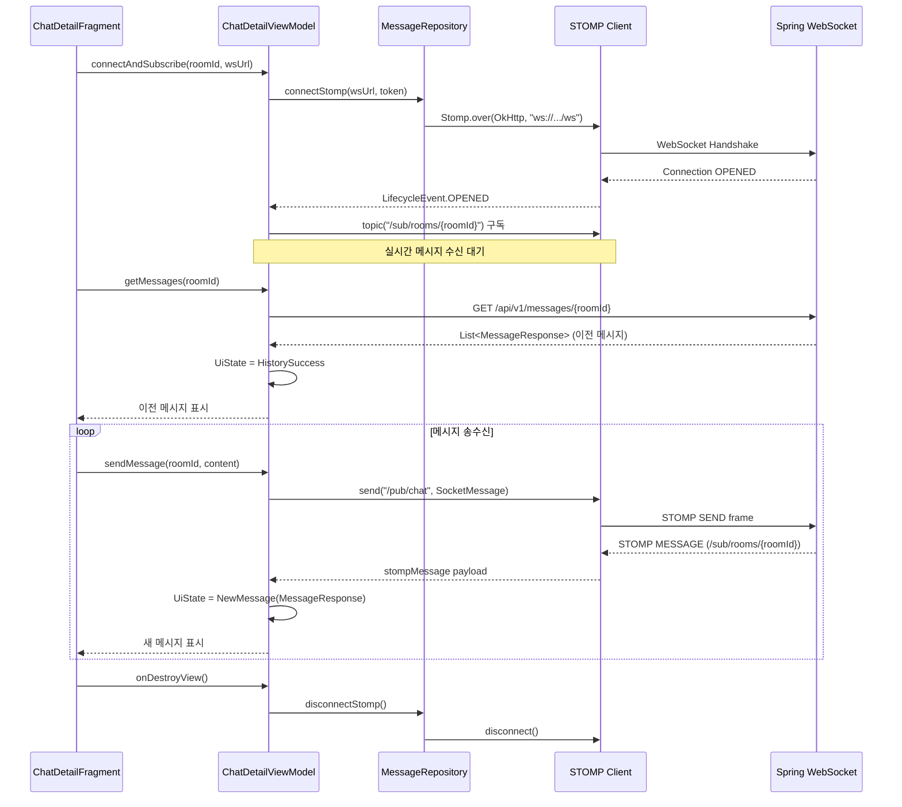
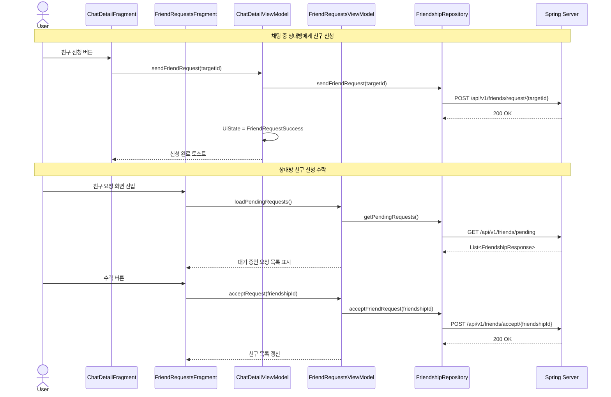
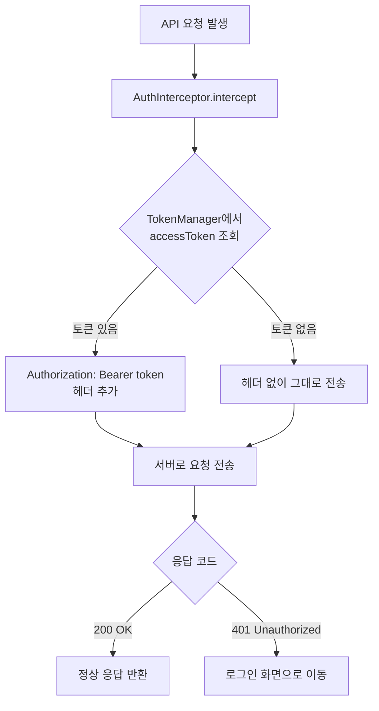

# Chatzar - 서비스 흐름 & 아키텍처

> 랜덤 매칭 기반 익명 채팅 Android 앱

---

## 1. 전체 아키텍처

---

## 2. 클린 아키텍처 레이어 구조

```mermaid
graph LR
    subgraph UI["UI (Fragment)"]
        direction TB
        U1[View 렌더링]
        U2[사용자 이벤트 수집]
        U3[StateFlow 구독]
    end

    subgraph VM["ViewModel"]
        direction TB
        V1[UiState 관리\nMutableStateFlow]
        V2[비즈니스 로직]
        V3[viewModelScope\nCoroutine]
    end

    subgraph Repo["Repository"]
        direction TB
        RE1[데이터 소스 추상화]
        RE2[API 호출 위임]
    end

    subgraph Data["Data Source"]
        direction TB
        D1[Retrofit API Interface]
        D2[DTO 매핑]
    end

    UI -- "함수 호출" --> VM
    VM -- "StateFlow emit" --> UI
    VM -- "suspend fun" --> Repo
    Repo -- "Response<T>" --> VM
    Repo -- "HTTP 요청" --> Data
    Data -- "JSON 응답" --> Repo
```

---

## 3. 인증 흐름 (Auth Flow)

---

## 4. 매칭 흐름 (Match Flow)

---

## 5. 실시간 채팅 흐름 (WebSocket / STOMP)

---

## 6. 친구 신청 흐름 (Friendship Flow)

---

## 7. 네트워크 인증 처리 (Token Interceptor)

