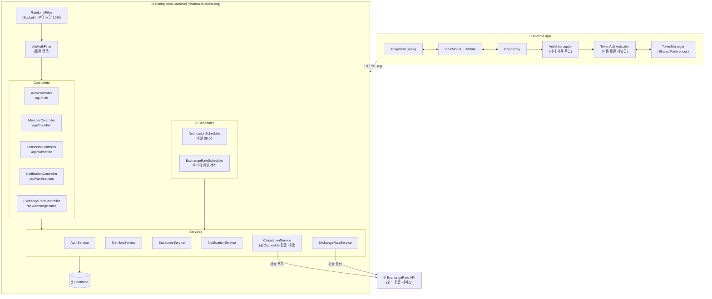
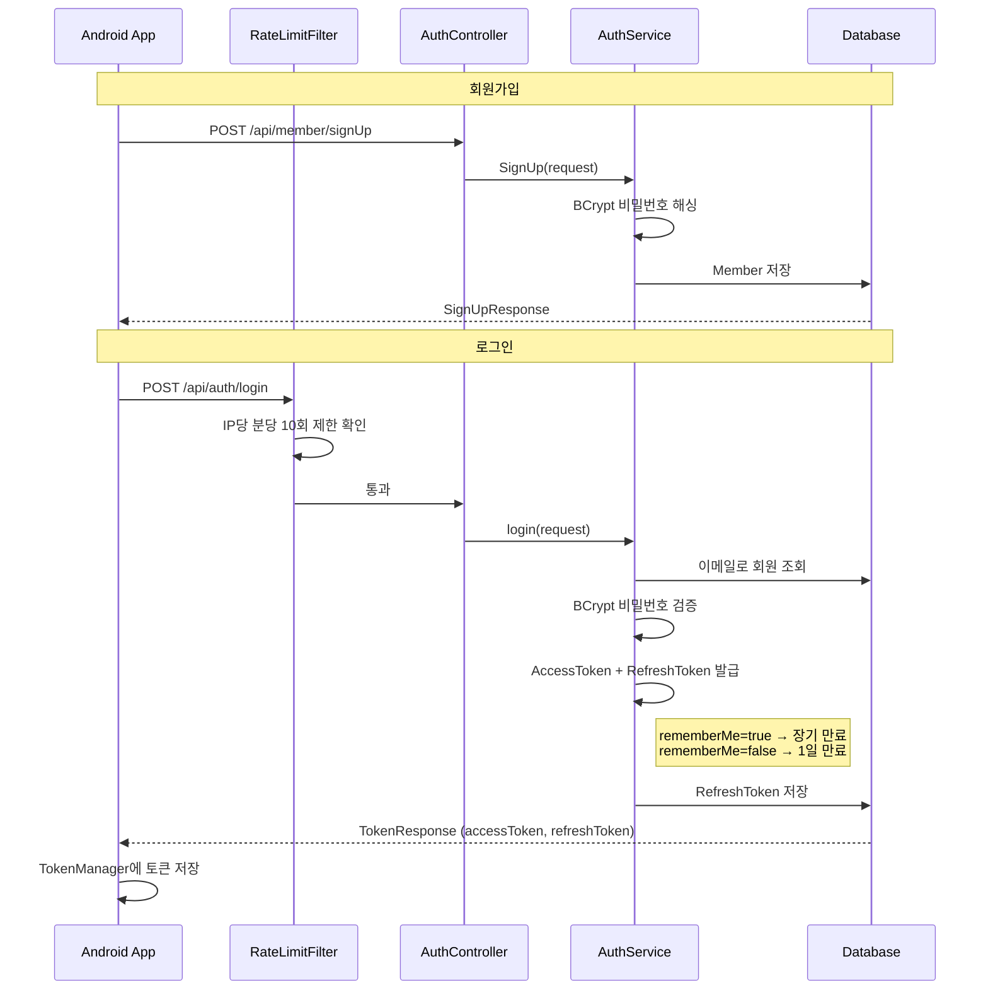
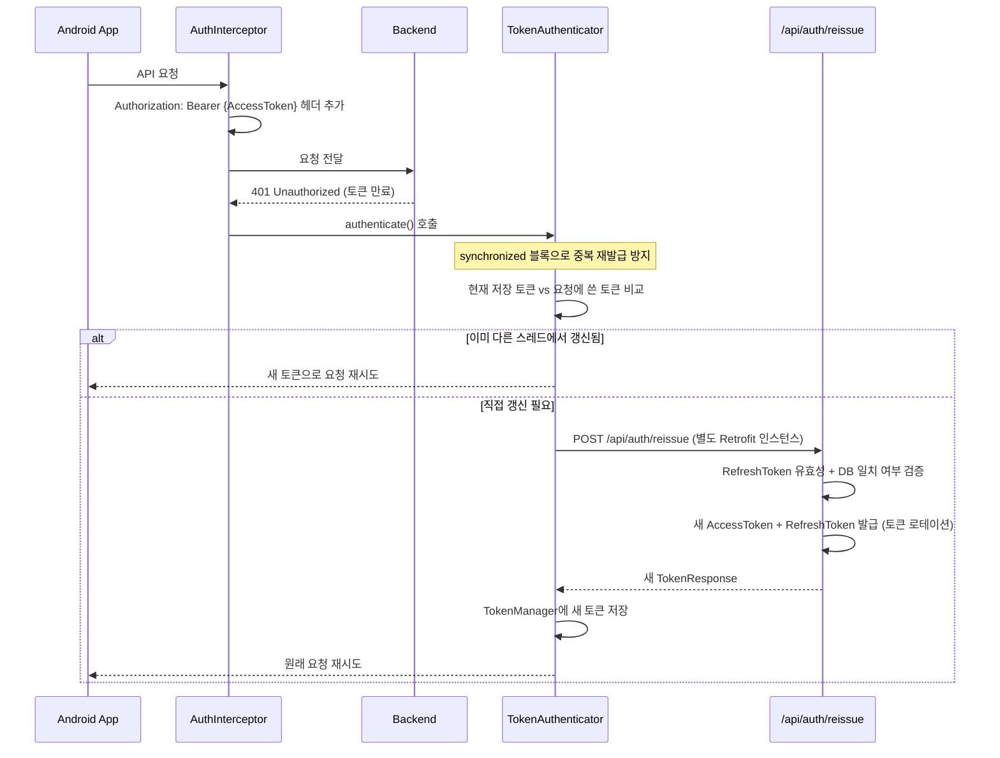
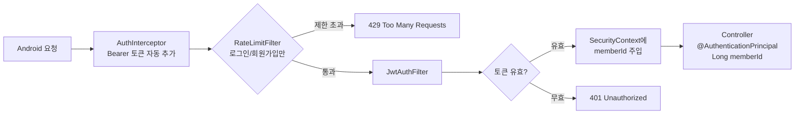
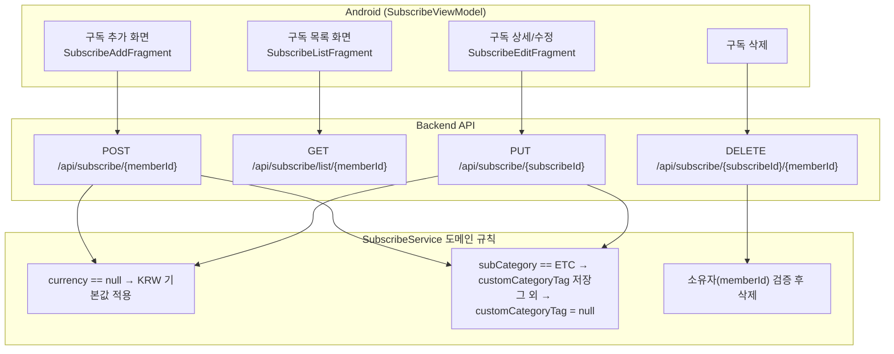
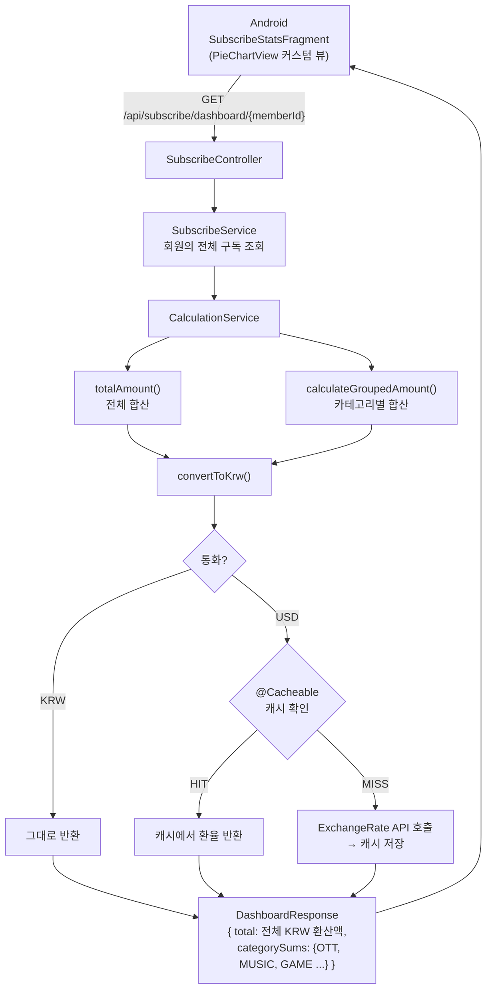
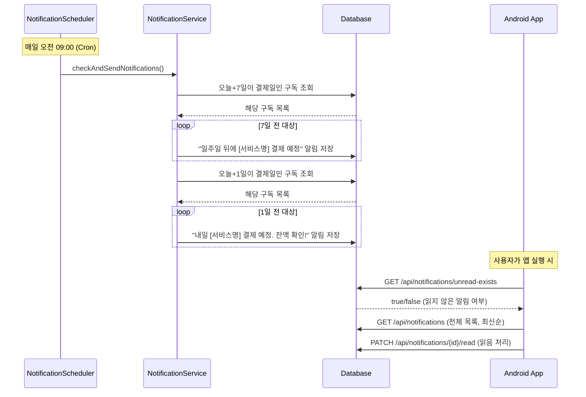
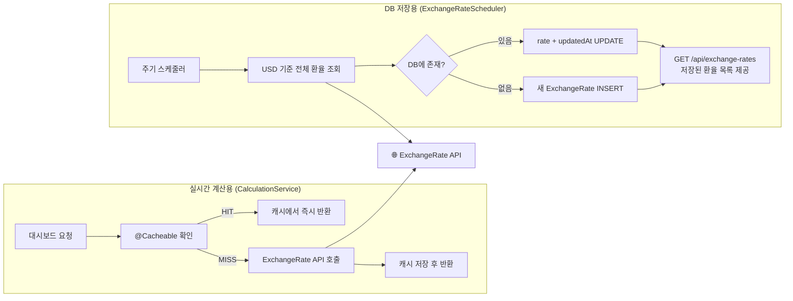

# Dalmoa 서비스 흐름

> **구독 서비스 관리 앱** — Android (Kotlin/MVVM) + Spring Boot Backend

---

## 1. 시스템 구성도

---

## 2. 인증 흐름

### 2-1. 회원가입 / 로그인

### 2-2. 토큰 만료 시 자동 재발급

---

## 3. 인증된 요청 공통 흐름

---

## 4. 구독 관리 흐름

---

## 5. 대시보드 / 통계 흐름

---

## 6. 알림 스케줄러 흐름

---

## 7. 환율 이중 구조

